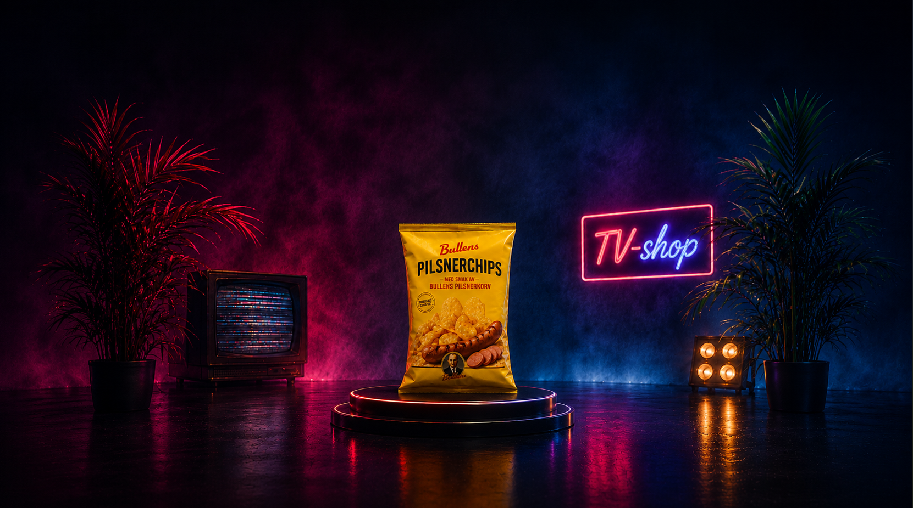
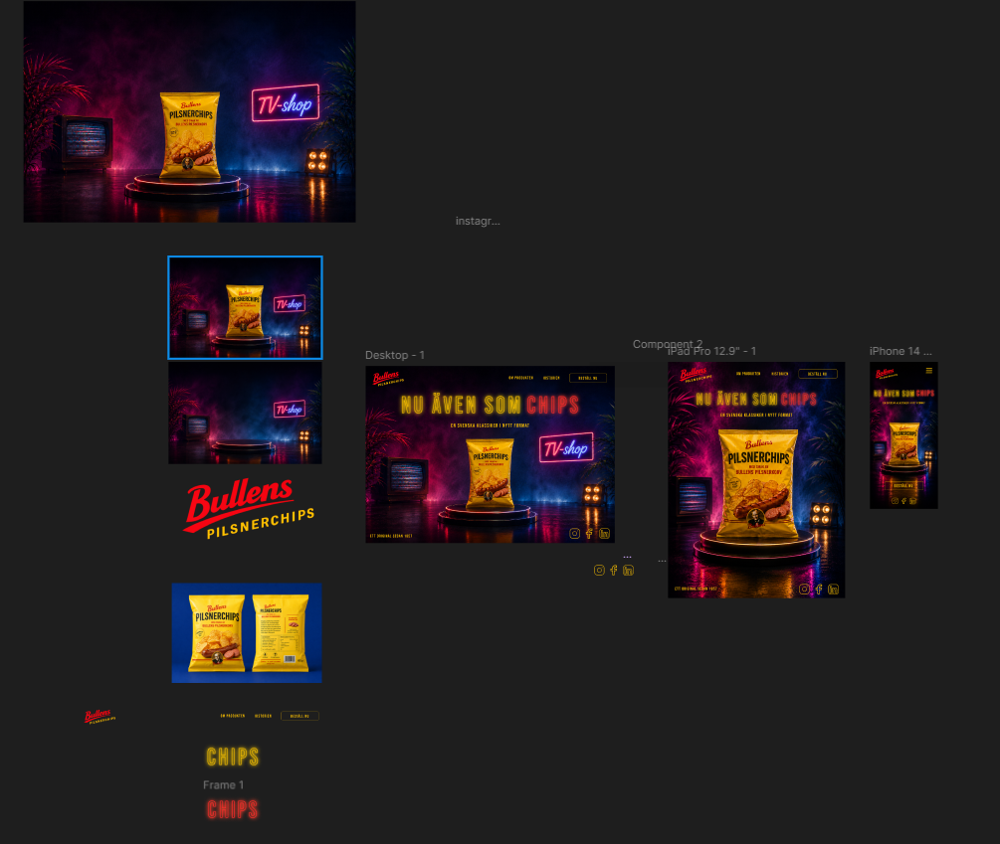

# 🎨 AI & SVG Assignment

This project combines both assignments into one complete desktop-optimized landing page experience.

The purpose of the project was to create a modern website that integrates AI-generated visuals together with animated SVG graphics in order to create a cohesive and interactive design.

The landing page is built with a modern frontend workflow using:

- HTML5
- SCSS
- JavaScript
- Vite

For animations the project uses:

- GSAP (GreenSock Animation Platform)
- SVG 
- CSS transitions and transforms

The animations are controlled using JavaScript timelines to create smooth and dynamic visual effects throughout the landing page.

The project was developed primarily for desktop viewing due to the limited scope and timeframe of the assignment, since it was intended to be a smaller and shorter project.

______________________________________________________________________________________

## 1. Generate an AI Image

Create and generate any AI image of your choice. Full creative freedom here.

- A placeholder image for a card component
- A website background
- A product image

### Possible tools/services:

- Midjourney
- Stable Diffusion
- Adobe Firefly
- OpenAI DALL·E
- Ideogram
- Google Imagen 3
- Grok
- Nanobanana

______________________________________________________________________________________

### Result generated with chatGPT

______________________________________________________________________________________

## 2. SVG

For the SVG part of the assignment, I created a design in Figma and exported it as an SVG file.

The SVG includes:

- Custom typography using a non-standard font
- Outlined text to preserve the appearance
- Animation effects

### Animation Examples

- Rotation
- Color transitions
- Motion effects

Since SVG is vector-based, the design scales without losing quality.

### Programs Used

- Figma
- Adobe Illustrator
- Inkscape

______________________________________________________________________________________

### Figma Prototype 

### Figma link 

https://www.figma.com/design/8JCXeITjXlvQ2UGxv6dTEP/Untitled?node-id=0-1&t=M0hVUYxAET7hWTem-1

______________________________________________________________________________________
